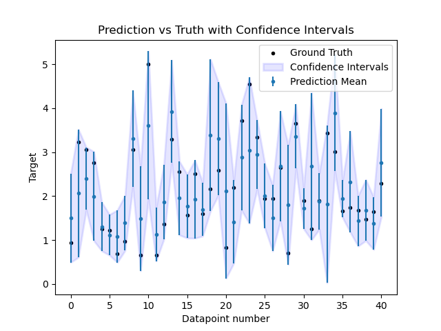
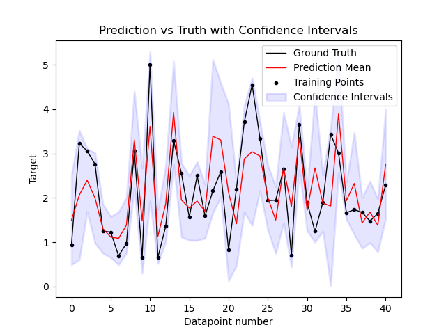

# MLUQ

MLUQ is a novel way to evaluate the accuracy of machine learning models and get better predictions that minimize maximum loss. Traditional methods use cross validation or a test set to evaluate the model giving a single score. In contrast MLUQ provides score with a confidence bound. Further, traditional ensemble methods use an average of all predictions (like random forest) as a prediction. In contrast, MLUQ uses a more complex algorithm using game theory that provides lower maximum loss.

## Loading the Conda environment
MLUQ comes with a prepared conda environment. The conda enviornment is stored in MLUQ.yml

1. Open a terminal and go to the directory containing the MLUQ.yml. 
2. Run "conda env create -f MLUQ.yml"

## get_estimator_probabilities
MLUQ is composed of 4 high level API functions. The first is get_estimator_probabilities.

This function takes in a dataset and performs a Min-Max decision theoretic game . It returns a set of trained estimators and their associated probabilities. The probabilities are essentially the weight the prediction should give to the estimator.

#### INPUTS
**CORES (integer >=1):** The number of cores to use for parallelization. The defult is 1.\
**number_of_estimators (integer >=1):** The number of estimators to use for prediction and probability assignment.\
**number_of_diracs (integer >=1):** The data is split into diracs or sometimes called folds in this code. The number_of_diracs is the number of splits.\
**bootstrap_fraction (float <= 1.0):** The data is sampled in the comparisons. The bootstrap_fraction is the fraction to sample from the data\
**purification_fraction (float <= 1.0):** When finding the probabilities there is a feature that compares the game data to a set of test comparisons in the data. This fraction is what fraction to use.\
**purification_repetitions (integer >=1):** The purification has to be run through repetitions. More repetitions creates more robust comparisons. More
repetitions takes longer computation time.\
**estimators_model (scikit-learn model):** The type of model to train. This must be a scikit-learn model. For Tensorflow, see the TF folder.\
**test_fraction (float <= 1.0):**  The comparisons in each trial are done on a test set. This is the fraction from the total data to use as a test set.\
**data_input (pandas dataframe):** This is the data that will be used in comparisons (training, predicting, etc.). If left blank as the default then the calfornia housing dataset from scikit learn will be used. Otherwise the data should be a pandas dataframe.\
**target_column (string):** The name of the column that holds the target variable in the data_input.\

#### OUTPUTS
**decision_theoretic_models (dictionary):** A dictionary of trained models of type estimators_model. The keys are sequential integers.\
**PII_probabilities (list):** The probability weights for each estimator in decision_theoretic_models.\

```python
from sklearn.datasets import fetch_california_housing
from sklearn.model_selection import train_test_split
import pandas as pd

from MLUQRegression import MLUQRegressionHighLevel
from sklearn.tree import DecisionTreeRegressor
from sklearn.metrics import mean_absolute_error

#fetch the data
housing_data = fetch_california_housing()
#convert the data to a pandas dataframe. convert only features for now
data = pd.DataFrame(data = housing_data.data, columns = housing_data.feature_names)
#set the target for the dataframe.
data['__Target__'] = housing_data.target 
#split the data into a train and test set
data_train, data_test = train_test_split(data, test_size = 0.2)


decision_theoretic_models, PII_probabilities = MLUQRegressionHighLevel.get_estimator_probabilities(			
                                                   CORES = 2,
						   number_of_estimators = 10,
						   number_of_diracs = 100,
						   bootstrap_fraction = float(0.005),
						   purification_fraction = 0.2,
						   purification_repetitions = 100,
						   estimators_model = DecisionTreeRegressor(max_depth = 10),
						   test_fraction = 0.2,
						   loss = mean_absolute_error,
						   data_input = data_train,
						   target_column = '__Target__',)
```

```
Training 1 Out Of 10
Training 2 Out Of 10
Training 3 Out Of 10
Training 4 Out Of 10
Training 5 Out Of 10
Training 6 Out Of 10
Training 7 Out Of 10
Training 8 Out Of 10
Training 9 Out Of 10
Training 10 Out Of 10


Running UQ 14 Out of 100
Running UQ 1 Out of 100
Success:  True

Running UQ 2 Out of 100
Success:  True

Running UQ 15 Out of 100
Success:  True

Running UQ 3 Out of 100
Success:  True

Running UQ 16 Out of 100
Success:  True

Running UQ 4 Out of 100
Success:  True

Running UQ 17 Out of 100
Success:  True
...
...
...
```


## predict_using_decision_theoretic_probabilities 
This function uses the outputs and probabilities from get_estimator_probabilities to predict on a dataset. The prediction and the loss from the true values are returned.


#### INPUTS
**CORES (integer >= 1):** The number of cores to use for parallelization. The defult is 1.\
**data (pandas dataframe):** The dataset to predict on.\
**estimators (dictionary):** A dictionary of estimators created using get_estimator_probabilities.\
**PII_probabilities (list):** The relative probabilities for each estimator in estimators. This is an output from get_estimator_probabilities.\
**loss (scikit learn loss function):** The loss function to evaluate the estimator predictions. Can be a scikit-learn function such as Mean Squared Error\
**target_column (string):** The name of the column that holds the target variable. The default is __Target__ but this will break if the target column is not __Target__. __Target__ will work if the default dataset is used in get_estimator_probabilities.\
**visualize_confidence_intervals (True or False):** Whether to visualize the confidence intervals from the test set predictions
**visualize fraction (float between 0.0 and 1.0 inclusive):** The fraction of the test data to visualize using confidence intervals. Only relevant if visualize_confidence_intervals is True
#### OUTPUTS
**predictions (list):** The predictions for the target on the data input.\
**loss (float):** The error between the predictions and the target using the loss function.\

```python
from sklearn.datasets import fetch_california_housing
from sklearn.model_selection import train_test_split
import pandas as pd

from MLUQRegression import MLUQRegressionHighLevel
from sklearn.tree import DecisionTreeRegressor
from sklearn.metrics import mean_absolute_error

#fetch the data
housing_data = fetch_california_housing()
#convert the data to a pandas dataframe. convert only features for now
data = pd.DataFrame(data = housing_data.data, columns = housing_data.feature_names)
#set the target for the dataframe.
data['__Target__'] = housing_data.target 
#split the data into a train and test set
data_train, data_test = train_test_split(data, test_size = 0.2)


decision_theoretic_models, PII_probabilities = MLUQRegressionHighLevel.get_estimator_probabilities(			
                                                   CORES = 2,
						   number_of_estimators = 10,
						   number_of_diracs = 100,
						   bootstrap_fraction = float(0.005),
						   purification_fraction = 0.2,
						   purification_repetitions = 100,
						   estimators_model = DecisionTreeRegressor(max_depth = 10),
						   test_fraction = 0.2,
						   loss = mean_absolute_error,
						   data_input = data_train,
						   target_column = '__Target__')


predictions, loss = MLUQRegressionHighLevel.predict_using_decision_theoretic_probabilities(
                        CORES = 2,
			data = data_test,
			estimators = decision_theoretic_models,
			PII_probabilities = PII_probabilities,
			loss = mean_absolute_error,
			target_column = '__Target__',
                        visualize_confidence_intervals = True,
                        visualize_fraction = 0.01)

print("predictions:", predictions)
print('loss:', loss)
```

```
Training 1 Out Of 10
Training 2 Out Of 10
Training 3 Out Of 10
Training 4 Out Of 10
Training 5 Out Of 10
Training 6 Out Of 10
Training 7 Out Of 10
Training 8 Out Of 10
Training 9 Out Of 10
Training 10 Out Of 10

Running UQ 1 Out of 100

Running UQ 14 Out of 100
Success:  True

Running UQ 2 Out of 100
Success:  True

Running UQ 15 Out of 100
Success:  True

Running UQ 16 Out of 100
Success:  True

Running UQ 3 Out of 100
Success:  True
Success:  True


Running UQ 17 Out of 100
Running UQ 4 Out of 100
Success:  True
...
...
...

Predicting 1 Out of 10
Predicting 2 Out of 10
Predicting 3 Out of 10
Predicting 4 Out of 10
Predicting 5 Out of 10
Predicting 6 Out of 10
Predicting 7 Out of 10
Predicting 8 Out of 10
Predicting 9 Out of 10
Predicting 10 Out of 10
predictions: [2.25559645 1.06244846 4.2186248  ... 1.01881052 3.71016924 1.63516409]
loss: 0.5669612007026236
```





## compare_to_naive_average

This function runs number_of_trials comparisons between MLUQ and naive average. The metrics are maximum folds (bins) error and overall average error. Each trial builds an ensemble of estimators_model with number_of_estimators. The ensemble is then tested on a test set with the decision theoretic  probabilities for each estimator and the naive average probabilities for each model. 

#### INPUTS
**CORES (integer >= 1):** The number of cores to use for parallelization. The defult is 1.\
**number_of_estimators (integer >= 1):** The number of estimators to use for prediction and probability assignment.\
**number_of_diracs (integer >= 1):** The data is split into diracs or sometimes called folds in this code. The number_of_diracs is the number of splits.\
**bootstrap_fraction (float <= 1.0):** The data is sampled in the comparisons. The bootstrap_fraction is the fraction to sample from the data\
**purification_fraction (float <= 1.0):** When finding the probabilities there is a feature that compares the game data to a set of test comparisons in the data. This fraction is what fraction to use.  \
**purification_repetitions (integer >= 1):** The purification has to be run through repetitions. More repetitions creates more robust comparisons. More repetitions takes longer computation time.\
**estimators_model (scikit-learn model):**  The type of model to train. This must be a scikit-learn model. For Tensorflow, see the TF folder.\
**number_of_trials (integer >= 1):** The number of comparisons to make between naive average and MLUQ.\
**test_fraction (float <= 1.0):** The comparisons in each trial are done on a test set. This is the fraction from the total data to use as a test set.\
**loss (scikit-learn loss function):** The loss function to evaluate the estimator predictions. Can be a scikit-learn function such as Mean Squared Error\
**data_input (pandas dataframe):** This is the data that will be used in comparisons (training, predicting, etc.). If left blank as the default then the calfornia housing dataset from scikit learn will be used. Otherwise the data should be a pandas dataframe.\
**target_column (string):** The name of the column that holds the target variable in the data_input.\

```python
from sklearn.datasets import fetch_california_housing
from sklearn.model_selection import train_test_split
import pandas as pd

from MLUQRegression import MLUQRegressionHighLevel
from sklearn.tree import DecisionTreeRegressor
from sklearn.metrics import mean_absolute_error

#fetch the data
housing_data = fetch_california_housing()
#convert the data to a pandas dataframe. convert only features for now
data = pd.DataFrame(data = housing_data.data, columns = housing_data.feature_names)
#set the target for the dataframe.
data['__Target__'] = housing_data.target 
target_column = '__Target__'
#split the data into a train and test set
data_train, data_test = train_test_split(data, test_size = 0.2)


MLUQRegressionHighLevel.compare_to_naive_average(
    CORES = 2,
    number_of_estimators = 10,
    number_of_diracs = 100,
    bootstrap_fraction = float(0.005),
    purification_fraction = 0.2,
    purification_repetitions = 100,
    estimators_model = DecisionTreeRegressor(max_depth = 10),
    number_of_trials = 10,
    test_fraction = 0.2,
    loss = mean_absolute_error,
    data_input = data,
    target_column = '__Target__' )
```

```
Running trial: 0 out of 10
Training 1 Out Of 1
Training 1 Out Of 10
Training 2 Out Of 10
Training 3 Out Of 10
Training 4 Out Of 10
Training 5 Out Of 10
Training 6 Out Of 10
Training 7 Out Of 10
Training 8 Out Of 10
Training 9 Out Of 10
Training 10 Out Of 10


Running UQ 14 Out of 100
Running UQ 1 Out of 100
Success:  True

Running UQ 15 Out of 100
Success:  True

Running UQ 2 Out of 100
Success:  True

Running UQ 16 Out of 100
Success:  True

Running UQ 3 Out of 100
Success:  True

Running UQ 17 Out of 100
Success:  True

Running UQ 4 Out of 100
Success:  True
...
...
...
Running trial: 1 out of 10
...
...
...
Running trial: 9 out of 10
...
...
...
```

```python
from sklearn.datasets import fetch_california_housing
from sklearn.model_selection import train_test_split
import pandas as pd

from MLUQRegression import MLUQRegressionHighLevel
from sklearn.tree import DecisionTreeRegressor
from sklearn.metrics import mean_absolute_error

#fetch the data
housing_data = fetch_california_housing()
#convert the data to a pandas dataframe. convert only features for now
data = pd.DataFrame(data = housing_data.data, columns = housing_data.feature_names)
#set the target for the dataframe.
data['__Target__'] = housing_data.target 
target_column = '__Target__'
#split the data into a train and test set
data_train, data_test = train_test_split(data, test_size = 0.2)

predictions, loss = MLUQRegressionHighLevel.predict_using_decision_theoretic_probabilities(
			CORES = 2,
			data = data_test,
			estimators = models,
			PII_probabilities = probabilities,
			loss = mean_absolute_error,
			target_column = '__Target__')

print('predictions:', predictions)
print('loss:', loss)
```

```
Predicting 1 Out of 10
Predicting 2 Out of 10
Predicting 3 Out of 10
Predicting 4 Out of 10
Predicting 5 Out of 10
Predicting 6 Out of 10
Predicting 7 Out of 10
Predicting 8 Out of 10
Predicting 9 Out of 10
Predicting 10 Out of 10
predictions: [1.55689055 2.79112237 4.02094551 ... 2.05497776 0.73701926 0.68180584]
loss: 0.5677882052297449
```

